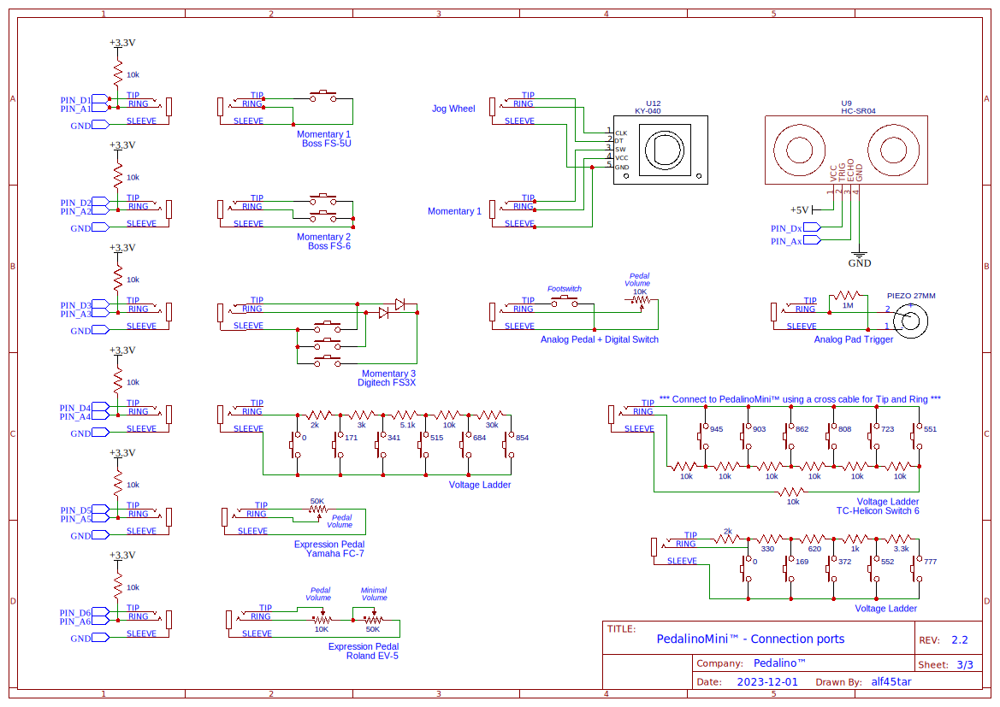
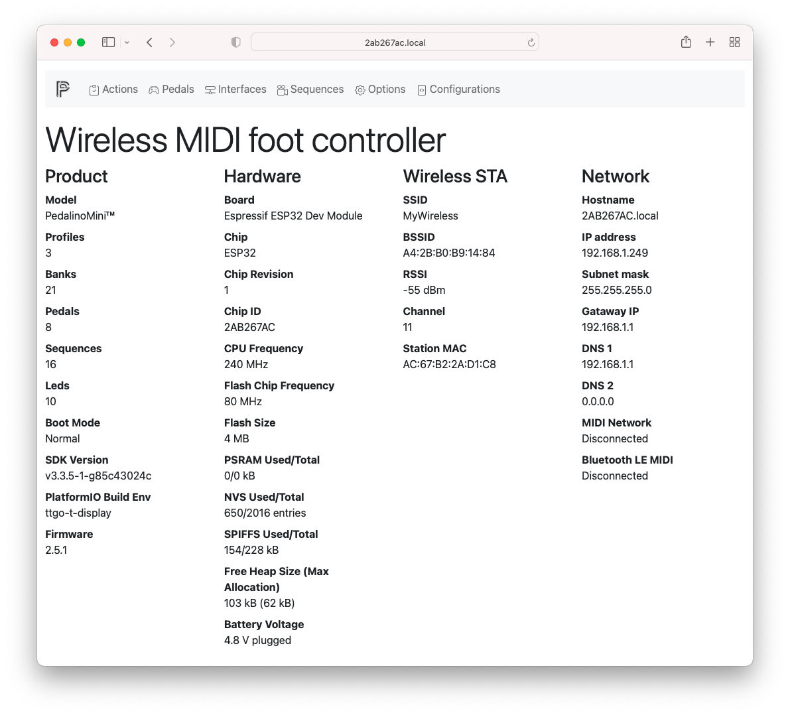
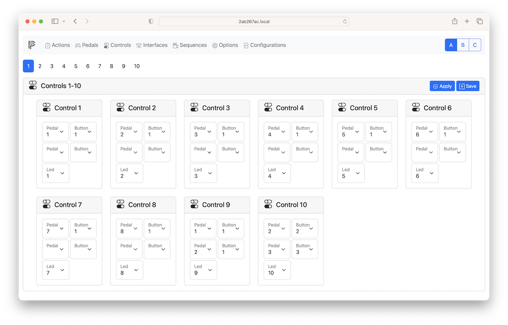
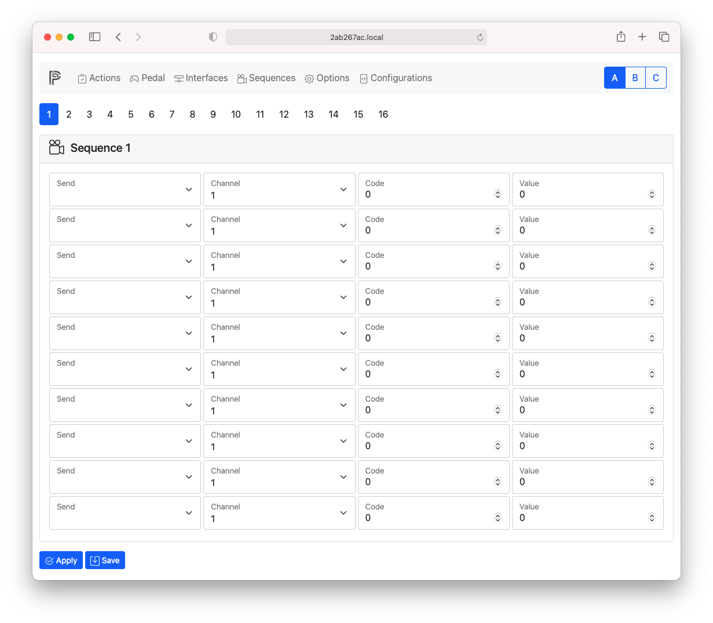
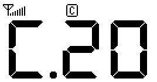

[](https://github.com/alf45tar/PedalinoMini-8)


# PedalinoMini™

Wireless MIDI foot controller for guitarists and more.

You can change the presets of your guitar rig, turn old MIDI equipment into something that’s USB-compatible, give you hands-free or foot-occupied ways to control your rig during a live performance, and it can be done with WiFi or Bluetooth. This is a full-featured MIDI controller, with three user profiles, and it can control a maximum of 36 foot switches. That’s an impressive amount of kit for such a small device; usually you’d have to spend hundreds or even thousands of dollars for a simple MIDI controller, and the PedalinoMini does everything with very cheap hardware.

- Plug-and-play with any MIDI-compatible app on iOS 8 and above as well as OS X Yosemite and above.
- High customizable using web interface
- Bluetooth, WiFI, USB and legacy MIDI interfaces
- No extra drivers to connect Windows, macOS, iOS (iPad/iPhone) and Android
- Bluetooth LE MIDI (iOS and macOS compatible)
- Network MIDI (aka AppleMIDI or RTP-MIDI)
- ipMIDI
- Open Sound Control (OSC)
- IEEE 802.11 b/g/n Wi-Fi 2.4 GHZ with WPA/WPA2 authentication
- Bluetooth Low Energy 4.0 server or client
- DIN MIDI IN and MIDI OUT connectors
- MIDI routing
- MIDI clock master and slave
- MIDI Time Code (MTC) master and slave
- OSC to MIDI and vicecersa
- Any number of pedals of any type in any order
- Auto-sensing footswitches and expression pedals
- Trigger-to-MIDI (soon)

## Features

- Support for digital foot switches (momentary or latch), analog expression pedals, jog wheels (rotary encoders) and triggers.
- 6 controllers ports for ESP32 and 8 controllers ports for ESP32S3. One controller port can support up to 6 indipendent switches for a total of 36 (ESP32) or 48 (ESP32S3) switches.
- 20 banks + 1 global bank
- 3 user profiles
- 20 sequences of 10 steps each
- Each port can connect 1 expression pedal or 1 jog wheel or up to 6 foot switches via a resitors ladder (TC HELICON Switch-6).
- MIDI output via AppleMIDI (also known as RTP-MIDI) or ipMIDI via Wi-Fi
- Send almost every MIDI messages: Program Change, Control Code, Note On/Off, Channel Pressure, Pitch Bend, Bank Select, Start, Stop, Continue or a sequence of the previous messages
- MIDI channel, MIDI note, MIDI control code, MIDI program change can be configured by each pedal and by each bank
- Switch debouncing and analog noise suppression without decreasing responsivenes
- Invert polarity via software
- Individual automatic calibration of expression pedals. Manual fine tuning is not usually requested.
- Transform a linear expression pedal into log expression pedal and vice versa
- Calibrating resistors ladder is easy as pressing footswitches in sequence
- RGB NeoPixel/WS2812B status leds
- Responsive and mobile-first configuration web interface (<http://pedalino.local>)
- Installing firmware and WiFi provisioning directly from your browser
- Smart Config technology to help users connect to a Wi-Fi network through simple app on a smartphone.
- OTA (Over the Air) firmware update or via HTTP (<http://pedalino.local/update>)

## PedalinoMini™ 4

An easy way to create one is by building the [PedalinoMini™ 4](https://github.com/alf45tar/PedalinoMini-4). I aimed to keep it as simple as possible.

[PedalinoMini™ 4](https://github.com/alf45tar/PedalinoMini-4) operates seamlessly with its 4 footswitches, featuring a big 1.9" color display equipped with WiFi, Bluetooth, and USB MIDI capabilities. It is powered through a USB-C port, using either a power adapter or, for enhanced convenience, a compact power bank, ensuring up to 6 hours of uninterrupted functionality.

[](https://github.com/alf45tar/PedalinoMini-4)

## PedalinoMini™ 8

Do you need more footswitches? [PedalinoMini™ 8](https://github.com/alf45tar/PedalinoMini-8) is for you.

[](https://github.com/alf45tar/PedalinoMini-8)

## Sponsors

New features, bug corrections, priority reply will be offered at zero-day to **sponsors only**. Sponsors will have access to a private repository.

New features and bug corrections will be released to this public repository when one of the following goals is met (whichever come first):

- **Five hundread stars**

  _Add a star to the project if you don't want be a sponsor._

  >Goal is 500 stars.

- **12 months from February 1st, 2024**

  _Be patience if you are not ready to add a star._

  >Goal is reached on February 1st, 2025.

When one of the previous goals will be reached sponsors will continue to receive in advance new versions and new goals will set.

Sponsors version additions/fixes since February 3st, 2024:
- Fixed simultaneous button press
- Increased sequences to 20
- Updated onboard Bootstrap to 5.3.3
- Fixed reboot on configuration load
- Enabled PSRAM for LILYGO® T-Display-S3
- Updated to ArduinoJson v7
- Fixed reboot on change profile via WebUI
- Fixed bank 0 Program Change leds
- Updated to Adafruit TinyUSB Library version 3 (configuration description override)
- Fixed LiLYGO® T-Display-S3 display off on battery
- Modified the voltage detection
- Fixed LiLYGO® T-Display-S3 leds strip and midi out pin overlap

[PedalinoMini™ Case 1](https://github.com/alf45tar/PedalinoMini-Case-1) is available to sponsors only.

## Public versions history

<details>
<summary>3.2.2 - February 3st, 2024</summary>

- BPI Leaf S3 new pins assignment
- ESPAsyncWebServer from esphome

</details>

<details>
<summary>3.2.1 - February 1st, 2024</summary>

- BPI Leaf S3 and LILYGO® T-Display-S3 USB MIDI device mode
- LILYGO® T-Display-S3 display support
- Fixed sequence led in configuration file
- Added MIDI Channel "None" (do not send any message but recorded as last message sent to be used with Repeat Overwrite) and "All"
- Fixed sequences loop when last slot is not empty
- Fixed an error preventing AP mode with ESP32 S3
- Added "MIDI Clock Master", "MIDI CLock Slave", "MIDI Clock Off", "Repeat", "Repeat Overwrite" to configuration file
- Updated onboard Bootstrap to 5.3.2
- Better battery voltage detection for BPI Leaf S3
- Updated SortableJS to 1.15.2
- Moved low priority tasks to Core 0
- Added `lilygo-t-display` target board with Espressif 6.5.0
</details>

<details>
<summary>3.1.6 - May 1st, 2023</summary>
- Fixed power off action
</details>

<details>
<summary>3.1.5 - April 30th, 2023</summary>

The following features:

- Bootstrap 5.2.2 onboard and latest via internet
- SortableJS 1.15.0
- Latest JSON Editor
- Better buttons placement in WebUI
- Fixed RGB order in cross led refresh
- Fixed BLE boot mode disabled when disabled in Options
- BLE client mode (define BLECLIENT in platformio.ini)
- Redesign of Pedals logic with Controls
- Simultaneous buttons press
- Control Change Snap (thanks to potul)
- OLED display bottom line fix (thanks to potul)
- Tag name truncated fix
- Led color on boot fix
- Add Debounce Interval and Simultaneous Gap Time in Options
- Press & Release event for streamline actions
- Inactivity timeout switch off display and leds
- Added Default as led option in Sequences
- Added "Set Bank" action in Sequences
- Added "Step by Step+" and "Step by Step-" to run sequence step by step forward and backward
- Added latch emulation for momentary switches
- Initial suppport for BPI Leaf S3 (no USB MIDI device/host)
- Increased Controls to 100
- Configuration file up to 256Kb when PSRAM is available
- Configuration file can be appended to current profile (only Actions)
- Switch profile (CC 00 [01-03] on channel 16) and bank (CC 32 [00-20] on channel 1&) via MIDI
- MIDI Clock and MIDI Time Code (MTC) fixes and improvements

has been released to public on April 30th, 2023. Thanks to the new sponsors: SrMorris, FelixMuellCode, MiqViq, serhatsoyyigit, potul, AndreySom, C*********, jimhiggs, A***********, Ratterbass, TarFilarek, S*********, bobvc133, itsptadeu, mosswind,,b*******, m*****, m*******, m********, TheNothingMan.
</details>

<details>
<summary>2.5.2 - September 23rd, 2022</summary>

Bonus version for doubling the stars on September 2nd, 2022.

- RGB Order saved in NVS
- Minor bug fixes
</details>

<details>
<summary>2.5.1 - August 2nd, 2022</summary>

The following features:

- Fixed reboot on Options page with a long list of visible WiFi network
- Fixed Note velocity always zero
- Added display flip vertically on TTGO T-Display
- Updated to latest JSON Editor 9.7.4
- Added flip display and leds RGB order in Options
- Fixed memory fragmentation during webpage creation
- A new pedal type to connect an expression pedal and a switch (momentary or ladder) to one port only
- Disabled WiFi power saving to reduce latency
- Added OSC local port, remote host and remote port in Options
- New "OSC Message" action sending integer and float values
- Experimental: replace NVS with JSON files

has been released to public on August 2nd, 2022 thanks to the following sponsors: b*******, basst22778, dbosnyak, d***********, slapukas, Samantha-uk, Poznik, FelixMuellCode, yusufrahadika and s*****.
</details>

<details>
<summary>2.4.0 - February 26th, 2022</summary>

The following features:

- Installing firmware and WiFi provisioning directly from browser
- Support for ultrasonic ranging module HC-SR04
- Adjusting easing and threshold for analog and ultrasonic sensor
- Fixed a bug that avoid to reach max value when analog calibration is on
- Improved Pedals web UI
- Fixed Program Change leds brightness
- Link each button to a led in Pedals setup in order to streamline Actions definition

has been released to public on February 26th, 2022. Thanks to the new sponsors: ClintR1984, pstechsolutions, mknerr, radioactivetoy, y0m1g, joesuspense, andeee, jsleroy, Viser, anssir, mattzzw.
</details>

<details>
<summary>2.3.2 - November 12th, 2021</summary>

  The following features:

- Bootstrap 5.1.3
- JSON Editor 9.5.6
- Reduced debounce interval from 20ms to 5ms
- Added "Set Led Color" action
- Redesigned Sequences (new web UI, new configuration file) - EEPROM breaking change
- Improved Actions web UI
- Bank duplication

has been released to public on November 12th, 2021. Thanks to the new sponsors: RomanKlein777, michaelhauser, bobvc133, bmarshall91, p*************.
</details>

<details>
<summary>August 9th, 2021</summary>

The following features/fixes:

- Bootstrap 5.0.2
- Fixed BOOT button actions in default configuration
- Fixed compilation error when BATTERY flag defined for board without battery support
- Fixed battery indicator for generic ESP32 board without battery support
- Fixed TTGO T-Display glitches
- Enable/disable incoming and outcoming MIDI messages display
- Universal expression pedal
- Fixed normal banks actions are not triggered when there are no actions in global bank
- Fixed actions disappering on WebUI after profile switch
- Drag & drop banks reorder
- Current bank saved before profile switch (only via pedal)
- Fixed Network MIDI/AppleMIDI/RTP-MIDI not working in AP mode
- Leds effects

has been released to public on August 9th, 2021 thanks to the following sponsors: richardjs, P********, j*****, TarFilarek. wespac001 x 2, DR-Mello, DWSQUIRES, e36910, itsptadeu.
</details>

<details>
<summary>May 12th, 2021</summary>

The following features:

- Detection and actions triggered on REPEAT PRESSED and LONG RELEASE event
- Latest Bootstrap 5 release and WebUI themes

has been released to public on May 12th, 2021 thanks to the following sponsors: @MaxZak2020, @Alt Shift Creative, @serhatsoyyigit, @Kubbik1, @rigr, @jwyse, @teopost, @davidin73, @juani13973, @ba********, @MiqViq, @jisv48.
</details>

## Bill of materials

The shortest bill of materials ever: an ESP32 board and a OLED display. That's it.

- Any ESP32 board supported by [Arduino core for ESP32](https://github.com/espressif/arduino-esp32)
  - Tested on [DOIT ESP32 DevKit V1](https://github.com/SmartArduino/SZDOITWiKi/wiki/ESP8266---ESP32) 4M dual-mode Wi-Fi and Bluetooth module
- OLED I2C 0.96"/1.3" display 128x64 pixels SSD1306/SH1106 based

Not enough short?

- An all-in-one [LILYGO® TTGO T-Display](http://www.lilygo.cn/prod_view.aspx?TypeId=50033&Id=1126&FId=t3:50033:3) with an 1.14" IPS display and onboard lithium battery interface

- An all-in-one [Heltec WiFi Kit 32](https://heltec.org/project/wifi-kit-32/) with an integrated OLED display (0.96") and onboard lithium battery interface

- An all-in-one [TTGO T-Eight ESP32](https://github.com/LilyGO/TTGO-T-Eight-ESP32) with a bigger OLED display (1.3"), 4MB PSRAM and onboard lithium battery interface

Not enough powerful?

- [BPI-Leaf-S3](https://wiki.banana-pi.org/BPI-Leaf-S3)
- [LILYGO® T-Display-S3](https://www.lilygo.cc/products/t-display-s3?variant=42351558590645)

USB MIDI (ESP32 only) and DIN MIDI connection requires additional hardware.

## Schematic




### Warnings

- Do not forget the add the pullup resistors on PIN_A1 to PIN_A6 otherwise pins will be floating. A floating pin can trigger unexpected MIDI events. As alternative you can disable the not used pedals via web interface.
- GPIO12 must be LOW during boot. MTDI (GPIO12) is used as a bootstrapping pin to select output voltage of an internal regulator which powers the flash chip (VDD_SDIO). This pin has an internal pulldown so if left unconnected it will read low at reset (selecting default 3.3V operation). Connect to the corresponding controller port only pedals that can guarantee a LOW value on boot. For more details check the official documentation [here](https://docs.espressif.com/projects/esp-idf/en/latest/api-reference/peripherals/sd_pullup_requirements.html#mtdi-strapping-pin).

To create your own ladder you can start simulating the below ones:

Simulate voltage ladder 2k 3k 5.1k 10k 30K
- [Thinkercad](https://www.tinkercad.com/things/7m1vdQfmXFo)
- [Circuit Simulation Applet](https://tinyurl.com/2mrlxab7)

Simulate voltage ladder 10k (TC-Helicon Switch 6)
- [Thinkercad](https://www.tinkercad.com/things/jnovvmmsONp)
- [Circuit Simulation Applet](https://tinyurl.com/2ptxv97t)

Simulate "D1 Robot LCD Keypad Shield" voltage ladder
- [Thinkercad](https://www.tinkercad.com/things/jQAR4Hrh3GH)
- [Circuit Simulation Applet](https://tinyurl.com/2zbrnsh6)

## How to upload firmware, WiFi provisioning and access to web user interface

Visit http://alf45tar.github.io/PedalinoMini/installer to install new firmware, update firmware, connect device to a WiFi network and visit the device's hosted web interface.

The only requirement for now is to use a Google Chrome or Microsoft Edge browser (Safari and iOS devices are not supported yet). WiFi provisioing via Bluetooth is only supported in Google Chrome on Windows.

<details>
<summary>Detailed instructions</summary>

1. Connect PedalinoMini™ to a PC via USB
2. Visit http://alf45tar.github.io/PedalinoMini/installer
3. Select the latest firmware available
4. Press "Connect"
5. Select the USB/UART port where PedalinoMini™ is connected and press "Ok"
6. Select "Install PedalinoMini™" and confirm to erase all data pressing "Install"
7. Wait a couple of minutes to complete the installation and press "Next" at the end
8. Reboot PedalinoMini™ and complete the WiFi provisioning
9. Press "Connect to WiFi"
10. Enter the Network Name and the Password of your WiFi and press "Connect"
11. Press "Visit device" to access web user interface
</details>

## USB MIDI using Raspberry Pi Pico (RP2040)

Raspberry Pi Pico is a generally available cost-effective board that can be used to add an USB MIDI connection.

### Method 1
Thanks to [Sthopeless](https://github.com/Sthopeless)

- Flash Pico with the .UF2 binary file provided here https://github.com/rsta2/pico/releases/tag/v1.0
- Connect ESP32 RX1 to Pico GP0 and ESP32 TX1 to Pico GP1 and GND to GND.

### Method 2

- Flash Pico with CircuitPhyton .UF2 binary file provided here https://circuitpython.org/board/raspberry_pi_pico. Tutorial available [here](https://learn.adafruit.com/getting-started-with-raspberry-pi-pico-circuitpython/circuitpython).
- Copy the CIRCUITPY folder files under the CIRCUITPY Pico drive. The CIRCUITPY folder contains the boot.py file and the [Adafruit CircuitPhyton MIDI](https://github.com/adafruit/Adafruit_CircuitPython_MIDI) library.
- Connect ESP32 RX1 to Pico GP0 and ESP32 TX1 to Pico GP1 and GND to GND.

For both methods:

ESP32 Pin|Pico Pin
---------|--------
RX1|GP0
TX1|GP1
GND|GND

- If the Pico is powered via USB, the VSYS must NOT be connected to other power source.
- [Optional] Power ESP32 board just feeding the power from the VBUS port on the Pico to VIN (if available) of the ESP32.

IMPORTANT: ESP32 board and Pico must share GND.

## USB MIDI using Arduino Pro Micro

The cheapest and compact way to implement an USB MIDI connection is using an Arduino Pro Micro and the [BlokasLabs/USBMIDI](https://github.com/BlokasLabs/USBMIDI) library. Upload the [UsbMidiConverter](https://github.com/BlokasLabs/USBMIDI/blob/master/examples/UsbMidiConverter/UsbMidiConverter.ino) example into the Arduino Pro Micro.

Serial1 of ESP32 (re-mapped to pin 18 RX and 19 TX) is connected to Serial1 (pin 1 TX0 and pin 2 RX1) of Arduino Pro Micro. Use a 3.3V Pro Micro board. A 5V Pro Micro board works too because the ESP32 is usually 5V tolerant.

Arduino Pro Micro is powered by the USB MIDI connection.

IMPORTANT: ESP32 board and Arduino Pro Micro must share GND.

## Booting modes

PedalinoMini™ has 8 booting modes:

Mode|Name|Description
----|----|-----------
1|Normal|BLE and WiFi are enabled. PedalinoMini™ starts the WiFi procedure on boot (connect to last AP -> WiFi Provisioning -> SmartConfig -> WPS -> Access Point).<br>After boot PedalinoMini™ will wait for BLE-MIDI connection.
2|Bluetooth Only|WiFi and Web UI are disabled.<br> PedalinoMini™ will wait for BLE-MIDI connection only.
3|WiFi Only|PedalinoMini™ starts the WiFi procedure on boot (connect to last AP -> WiFi Provisioning -> SmartConfig -> WPS -> Access Point).<br>BLE is disabled.
4|Access Point with Bluetooth|PedalinoMini™ skip the WiFi procedure on boot and create a WiFi Access Point.<br>PedalinoMini™ will wait for BLE-MIDI connection too.
5|Access Point without Bluetooth|PedalinoMini™ skips the WiFi procedure on boot and create a WiFi Access Point.<br>BLE is disabled.
6|Reset WiFi credentials|Forget the last connected access point.<br>On next boot PedalinoMini™ can be connected to a new AP.
7|Ladder Config|Learn mode for your ladder pedal. Any resistors ladder (up to 6 buttons) can be calibrated just pressing footswitches in any sequence. During calibration press and hold the footswitch until the timeout expires (the upper bar reaches zero) and the measure is acquired with a value in the botton bar. After calibration footswitches are numbered depending of the corresponding analog value: lower value lower number. TC HELICON Switch-6 footswitch 1 correspond to button 6, footswitch 2 to button 5, and so on until footswitch 6 to button 1.<br>Configure at least one pedal as Ladder before to proceed with configuration.
8|Reset to factory default|

The last booting mode (1-5) is selected if you don't press any button on boot.

The default boot mode is (1) Normal.

To select a different mode:

- Press and release EN button (POWER button on TTGO T-Eight) and immediately after press and hold BOOT button (CENTER button on TTGO T-Eight)
- Follow the istructions on display. Keep it pressed until the progress bar reach the end to reset to factory default. If you release the button before the progress bar reach the end PedalinoMini™ will start in one of the supported boot mode.

Mode|Name|USB-MIDI|Legacy MIDI|RTP-MIDI|ipMIDI|BLE MIDI|OSC|Web UI|OTA Firmware Update|HTTP Firmware Update
:--:|----|:------:|:---------:|:------:|:----:|:------:|:-:|:----:|:-----------------:|:------------------:
1|Normal|x|x|x|x|x|x|x|x|x
2|Bluetooth Only|x|x|-|-|x|-|-|x|-
3|WiFi Only|x|x|x|x|-|x|x|x|x
4|Access Point with Bluetooth|x|x|x|x|x|x|x|x|x
5|Access Point without Bluetooth|x|x|x|x|-|x|x|x|x

- (x) Supported
  (-) Not supported
- USB-MIDI and DIN-MIDI are always available if hardware implemented.

## How to build and upload

[PlatformIO](https://platformio.org) is the recommended IDE for PedalinoMini™ build and upload.

1. Install [PlatformIO IDE for VSCode](https://platformio.org/install/ide?install=vscode)
2. Install Git
    - On Windows, install git from https://git-scm.com/download/win
    - On macOS, install Command Line Tools for Xcode running `xcode-select --install` via Terminal. Remember to run the command every time you update your macOS.
3. In VSCode run the following commands:
    - from View->Command Palette (Ctrl+Shift+P)
        - Git: Clone
        - You will be asked for the URL of the remote repository (<https://github.com/alf45tar/PedalinoMini>) and the parent directory under which to put the local repository.
    - under PlatformIO Project Tasks select your environment (i.e. env:esp32doit-devkit-v1)
        - Click "Build" under General
        - Click "Upload" under General
        - Click “Upload File System Image” under Platform. Do not skip this step otherwise the WebUI will not works properly.

That's all folks.

> Before any update save configuration, reset to factory default and reload configuration. EEPROM can change without any further advice.

## How to connect PedalinoMini™ to a WiFi network

PedalinoMini™ supports IEEE 802.11 b/g/n WiFi with WPA/WPA2 authentication (only 2.4 GHz).

PedalinoMini™ support 5 WiFi provisioning methods: 1 via USB, 1 via Bluetooth and 3 via WiFi.

PedalinoMini™ is using [ESP Web Tools](https://esphome.github.io/esp-web-tools/) not only to install the firmware, via USB with a click of button right from you browser, but also to connect it to WiFi with the same simplicity via USB or Bluetooth.

PedalinoMini™ also implements Wi-Fi Protected Setup (WPS) and Smart Config technology ([Espressif’s ESP-TOUCH protocol](https://www.espressif.com/en/products/software/esp-touch/overview)). WPS needs access to the WPS button on the WiFi router. Smart Config requires a smartphone with one the following apps:

- [ESP8266 SmartConfig](https://play.google.com/store/apps/details?id=com.cmmakerclub.iot.esptouch) for Android
- [Espressif Esptouch](https://itunes.apple.com/us/app/espressif-esptouch/id1071176700?mt=8) for iOS

If the WiFi network is not available PedalinoMini™ will create an hotspot for you. Once connected to the PedalinoMini™ hotspot, you can use the web interface to set the SSID and password of an access point that you would like to connect to.

- On power on PedalinoMini™ will try to connect to the last know access point
- If it cannot connect to the last used access point within 15 seconds it enters into WiFi provisioning mode via USB or Bluetooth
- Visit http://alf45tar.github.io/PedalinoMini/installer and follow the instructions
- If provisioning is not finished within 60 seconds it enters into Smart Config mode (if compiled with -D SMARTCONFIG in platformio.ini)
- Start one of the suggested apps to configure SSID and password
- If it doesn't receive any SSID and password during the next 60 seconds it enters into WPS mode (if compiled with -D WPS in platformio.ini)
- Press or press and hold (it depends by your router) the WPS button on your WiFi router __after__ PedalinoMini™ entered in WPS mode
- If it doesn't receive any SSID and password during the next 60 seconds it switch to AP mode
- In AP mode PedalinoMini™ create a WiFi network called 'Pedalino-XXXXXXXX' waiting connection from clients. The required password is XXXXXXXX (uppercase). XXXXXXXX is a variable string.
- Reboot PedalinoMini™ to restart the procedure.

Any of the previous steps can be skipped pressing BOOT button.

```C++
void wifi_connect()
{
  auto_reconnect();           // WIFI_CONNECT_TIMEOUT seconds to reconnect to last used access point
  if (!WiFi.isConnected())
    improv_config();          // IMPROV_CONFIG_TIMEOUT seconds to receive provisioning SSID and password via USB or Bluetooth and connect to WiFi
  if (!WiFi.isConnected())
    smart_config();           // SMART_CONFIG_TIMEOUT seconds to receive SmartConfig parameters and connect
  if (!WiFi.isConnected())
    wps_config();             // WPS_TIMEOUT seconds to receive WPS parameters and connect
  if (!WiFi.isConnected())
    ap_mode_start();          // switch to AP mode until next reboot
}
```

## How to connect to the web user intertace

The responsive and mobile-first configuration web user interface is available on `http://device-name.local` address (the address is case insensitive). The device identification name is unique per device. Every device/board has a different device name. For example I am using `http://2ab267ac.local` to connect to my PedalinoMini™.



In order to know your device name and/or the IP address press for at least half a second the BOOT button and check the display.

As alternative method you can use the IP address. If you are using the AP mode the IP address is always `192.168.4.1` and the connection address is `http://192.168.4.1` for everyone.

The default username and password to connect to web user interface are `admin` as username and your `device-name` in __uppercase__ as password. For example I am using `admin` as username and `2AB267AC` as password.

Device name, username and password can be changed via web user interface in the Options page.

## Pedals

Once PedalinoMini™ is connected to a WiFI network and you are connected to the web user interface it is time to configure which pedal is connected to each of the 6 available ports. Pedal 7, 8 and 9 (if present) are the on board buttons and they are fully configurable.


____________|Description
:-----------|:----------
Mode|Select one of the following: NONE, MOMENTARY, LATCH, ANALOG, JOG WHEEL, MOMENTARY 2, MOMENTARY 3, LATCH 2, LADDER, ULTRASONIC, ANALOG+MOMENTARY, ANALOG+LATCH.
Invert Polarity|Normally open (NO) and normally closed (NC) momentary switches are supported and configurable by software if the foot switch do not have a polarity switch. On analog pedal or ultrasonic ranging sensor it invert the range.
Singles Press|Select Enable/Disable here to enable/disable PRESS, RELEASE and CLICK events.<br>CLICK event is detected after a PRESS followed by a RELEASE event on momentary switches and on PRESS and on RELEASE on latch switches.
Double Press|Select Enable/Disable here to enable/disable DOUBLE CLICK events.<br>If double press is enabled CLICK event is postponed until double press timeout (by default 400ms).
Long Press|Select Enable/Disable here to enable/disable LONG PRESS, REPEAT PRESSED and LONG RELEASE events.<br>LONG PRESS event is detected after a PRESS event with no RELEASE event within the long press timeout (by default 500ms).<br>After a LONG PRESS event a REPEAT PRESSED event is triggered every repeat press timeout (by default 1000ms) until the button is keep pressed.<br>After a LONG PRESS event the RELEASE event is replaced by a LONG RELEASE event.<br>Two sequences of events are possible: PRESS and RELEASE or PRESS, LONG PRESS, REPEAT PRESS (optional) and LONG RELEASE.
Analog Calibration|Enable analog pedal continuous calibration. Min and Max values are managed by PedalinoMini™. After each power on cycle move the expression pedals to its full range and PedalinoMini™ will calibrate it. During the first full movement of the pedal MIDI events could be not precise because PedalinoMini™ is still learning the full range of the pedal.
Analog Response|Mapping between analog pedal movement and response. Accepted values: LINEAR (as is response), LOG (great acceleration but than flat), ANTILOG (start slow with a rapid increase).
Min|In ANALOG mode minumum digital value (after analog-to-digital conversion) that can reach the connected expression pedal.<br>In ULTRASONIC mode the minimum distance (250 is around 2cm and it is not recommended to go below). Acceptable values are from 0 to 1023
Max|In ANALOG mode maximum digital value (after analog-to-digital conversion) that can reach the connected expression pedal.<br>In ULTRASONIC mode the maximum distance (1023 is around 18cm and it is far enough for the application). Acceptable values are from 0 to 1023.
Easing|It controls the amount of easing. Possible values are: 1, 2 or 3. Bigger value makes the responsive values more responsive: output value follows immediately the input value. Recommended values: 1 for ultrasonic sensor, 2 or 3 for potentiometer.
Activity Threshold|The amount of movement that must take place for it to register as activity and start moving the output value. Increase the value to suppress noisy potentiometer. Recommended values: 8 or 16 for potentiometer, 64 for ultrasonic sensor.

## Controls

A control is a single switch of a pedal (i.e. button 2 of pedal 4) or a combination of 2 switched of any pedal to be pressed simultaneous. Controls are used to logical sort and hide the physical connection of switches or to define a new control as simultaneous press of 2 switches.

Actions are triggered by controls. As a consequence a control is needed also for analog and ultrasonic pedals.

Due to hardware limitation simultaneous press do not works with 2 switches of the same MOMENTARY 3, LATCH 3 and LADDER. Instead simultaneous press works well between one switch of a MOMENTARY 3/LATCH 3/LADDER pedal and any other switch of a different pedal of any type. Simultaneous press works well between the 2 switches of the same MOMENTARY 2 or LADDER 2 pedal.

For each control it is possible to define the default led number to be used in Actions. It helps to simply the hardware leds connections but keeping each led logically linked to a switch.

Of course the simultaneous release, double click and long press are supported too even if they are not so usefull.



## Actions

Once Controls setup is complete proceed with Actions setup to define which event (press, release, double press, long press, repeat pressed, long release, move or jog) trigger an action.

1. Select a bank on top left. Bank 0 is also called global bank. Actions added to bank 0 are active in all the others banks.
2. Select a control on top right or "All"
3. (Optional) Enter the Bank Name
4. Click on New Action and select a control on the dropdown menu.


________|Description
:-------|:----------
On|The event that trigger the action.<br>Momentary switches, latches and ladders have 7 different events: PRESS, RELEASE, PRESS&RELEASE, CLICK, DOUBLE CLICK, LONG PRESS, REPEAT PRESSED and LONG RELEASE. All of them need to be enabled on Pedals level otherwise the action is not triggered.<br>Analog expression pedals have only MOVE event.<br>Jog wheels have only JOG event.
Control|The control that trigger the event as defined in Controls page.
Send|The action to be triggered on event.<br>It can be a MIDI message (PROGRAM CHANGE, CONTROL CHANGE, NOTE ON, NOTE OFF, PITCH BEND, CHANNEL PRESSURE, START, STOP, CONTINUE), a special action (BANK SELECT+, BANK SELECT-, PROGRAM CHANGE+, PROGRAM CHANGE-, BANK+, BANK-, MTC START, MTC STOP, MTC CONTINUE, TAP, BPM+, BPM-) or a SEQUENCE of them.<br>For an analog pedal leave it blank to activate the universal mode. In universal mode an analog pedal can be used to repeat the last MIDI message. A typical usage is to modify the value of the last CONTROL CHANGE.
From Value/To Value|Define the range from a off value to a on value (see below).
Tags When Off|Action name to display when off action is triggered.
Tags When On|Action name to display when on action is triggered.
Led|Select the led number and the off and on color. Use Default for use the default led defined in Pedals.

Action|MIDI Channel|MIDI Code|From|To
:-----|:----------:|:-------:|:--:|:--:
Program Change|Channel|PC#|-|-
Control Change|Channel|CC#|From Value|To Value
Control Change Snap|Channel|CC#|From Value|To Value
Note On|Channel|Note|Velocity|-
Note Off|Channel|Note|Velocity (+)|-
Bank Select+|Channel|MSB|From LSB|To LSB
Bank Select-|Channel|MSB|From LSB|To LSB
Program Change+|Channel|-|From PC#|To PC#
Program Change-|Channel|-|From PC#|To PC#
Pitch Bend|Channel|-|-|-
Channel Pressure|Channel|-|-|-
MIDI Clock Master|-|-|-|-
MIDI Clock Slave|-|-|-|-
MIDI Clock Off|-|-|-|-
Start|-|-|-|-
Stop|-|-|-|-
Ccontinue|-|-|-|-
Sequence|-|Sequence #|-|-
Step By Step+|-|-|-|-
Step By Step-|-|-|-|-
Bank+|-|-|From Bank|To Bank
Bank-|-|-|From Bank|To Bank
MTC Master|-|-|-|-
MTC Slave|-|-|-|-
MTC Off|-|-|-|-
MTC Start|-|-|-|-
MTC Stop|-|-|-|-
MTC Continue|-|-|-|-
Tap|-|-|-|-
BPM+|-|-|-|-
BPM-|-|-|-|-
OSC Message|-|-|-|-
Profile+|-|-|From Profile#|To Profile#
Profile-|-|-|From Profile#|To Profile#
Set Led Color|-|-|-|-
Repeat|-|-|-|-
Repeat Overwrite|Channel|-|From Value|To Value
Device Info|-|-|-|-
Power On/Off|-|-|-|-

- (-) Not used
- (+) if velocity is not zero it is equivalent to NOTE ON
- MSB is the Most Significat Byte. It is a fixed value from 0 to 127.
- LSB is the Less Significat Byte. It is the variable value from 0 to 127.

## Interfaces


The supported interfaces are:

Interface|Description
:--------|:----------
USB MIDI|Plug&play USB MIDI interface. Requires additional hardware (see schematic).
Legacy MIDI|Legacy serial MIDI interface with 5 pins DIN connectors. Requires additional hardware (see schematic).
RTP-MIDI|RTP-MIDI also know as AppleMIDI or Network MIDI. It is based on UDP protocol and it requires WiFi.
ipMIDI|ipMIDI is a multicast UDP protocol and it requires WiFi. ipMIDI works only if both end points are connected to the same 2.4 GHz WiFi network. Same router is not enough when one end point is connected to a 5 GHz WiFi network or to a different 2.4 GHz WiFI network hosted by the same router.
BLE MIDI|Requires Bluetooth Low Energy (BLE).
OSC|OSC messages are based on UDP protocol and it requires WiFi.

For each interface there are 4 filtering options:

______|Description
:-----|:----------
IN|Enable/disable receiving MIDI messages from the interface
OUT|Enable/disable sending MIDI messages to the interface
THRU|Enable/disable so called MIDI Thru (every message received from the IN port is automatically sent to the OUT port of the same interface)
CLOCK|Enable/disable receiving and sending CLOCK MIDI message

Routing between different interfaces is enabled between every IN enabled interfaces to any OUT enabled interfaces. Do not confuse routing (different interfaces) with MIDI Thru (between IN and OUT of same interface).

## Sequences



## Options

PedalinoMini™ has a lot of options well documented in the Options page.


## Configurations

The complete profile setup can be saved as configuration to be used later or just for backup reason in case of hardware failure. Configuration files can be downloaded and shared with others PedalinoMini™ users.
A complete configuration file editor is provided for advanced operations.


Some example configurations are provides. The default configuration for [PedalinoMini™ Case 1](https://github.com/alf45tar/PedalinoMini-Case-1) is available as 'case1'.

### iRig BlueBoard

PedalinoMini™ can emulate an [IK Multimedia iRig Blueboard](https://www.ikmultimedia.com/products/irigblueboard/) using 'blueboard' configuration. Midi Mode 1 is on bank 1 and Midi Mode 2 is on bank 2. PedalinoMini™ emulation works on any MIDI interface and not only "MIDI over Bluetooth" as the original iRig Blueboard.

### Fender Mustang Amplifier

PedalinoMini™ can control a Fender Mustang I/II/III/IV Amplifier via MIDI. Additional [software](https://github.com/alf45tar/mustang-midi-bridge-win) is required to translate MIDI messages to the proprietary USB protocol used by Fender Mustang amplifiers. The bonus configuration is called 'mustang' and works with 3 momentary switches and 3 jog wheels.

## Display mode

Where|What|Display|Description
:---:|:--:|-------|:----------
Bank Name|Empty||If the current bank name is empty the current profile and the current bank is shown using a vintage 7 segment LED style. First digit is the profile, the others two are for bank.
Bank Name|Any||If current bank name is not empty the bank name is displayed within the 6 pedal names. PedalinoMini™ assumes the first action tag for the pedal as its pedal name. The bank name screen will switch every 4 seconds to display pedals current value if no event occurs.
Bank Name|:||If the bank name start with colon (:) the bank name is always shown (if no event occurs).
Bank Name|.||If bank name start with point (.) the current values are shown and events update values in real time without any display switch.
Bank Name|##||A double hashtag sign (##) in bank name is replaced with the bank number.
Action Tags|:||If action tag start with colon (:) the display is not switched when an event occurs.
Action Tags|.||If action tag end with dot (.) the corresponding led and color is set on boot.
Action Tag|###||A triple hashtag sign (###) in action tag is replaced with the current value of the parameter.

## How to switch profiles

During normal operation

- Single press of BOOT button to move to the next profile
- Double press of BOOT button to move to the previous profile
- Long press of BOOT buttom to switch between live performance display and scrolling pages where configuration parameters (the device name, the IP address etc.) are displayed.

On TTGO T-Eight replace BOOT button with CENTER button.

## End User Built (oldest first)

https://github.com/marosell

[More details](https://github.com/alf45tar/PedalinoMini/issues/22)

https://github.com/mknerr


https://github.com/alf45tar


https://github.com/jimhiggs


https://github.com/raidolo


https://github.com/bsos


https://github.com/rigr

[More details](https://github.com/alf45tar/PedalinoMini/issues/138)

https://github.com/Hans68

[More details](https://github.com/alf45tar/PedalinoMini/issues/63)

https://github.com/teopost

[More details](https://github.com/alf45tar/PedalinoMini/issues/186)

https://github.com/gallochri

[More details](https://github.com/alf45tar/PedalinoMini/issues/214)

https://github.com/juani13973/pedalinio-18-footswitches-prototype

[More details](https://github.com/alf45tar/PedalinoMini/issues/229)

https://github.com/MaxZak2020


https://github.com/aFunkyBass

[More details](https://github.com/alf45tar/PedalinoMini/issues/234)

https://github.com/akosbeke

[More details](https://github.com/alf45tar/PedalinoMini/issues/240)

https://github.com/borsei222

[More details](https://github.com/alf45tar/PedalinoMini/issues/241)

https://github.com/TarFilarek

[More details](https://github.com/alf45tar/PedalinoMini/issues/221)

https://github.com/bobvc133

[More details](https://github.com/alf45tar/PedalinoMini/issues/330)

https://github.com/Samantha-uk

[More details](https://github.com/alf45tar/PedalinoMini/issues/342)

https://github.com/potul

[More details](https://github.com/alf45tar/PedalinoMini/discussions/398)

https://github.com/Celticpure

[More details](https://github.com/alf45tar/PedalinoMini/discussions/404)

https://github.com/jimhiggs

[More details](https://github.com/alf45tar/PedalinoMini/discussions/407)

https://github.com/Keeze

[More details](https://github.com/alf45tar/PedalinoMini/discussions/430)

https://github.com/mattzzw

[More details](https://github.com/alf45tar/PedalinoMini/discussions/438)

https://github.com/Jelle7and9

[More details](https://github.com/alf45tar/PedalinoMini/discussions/454)
