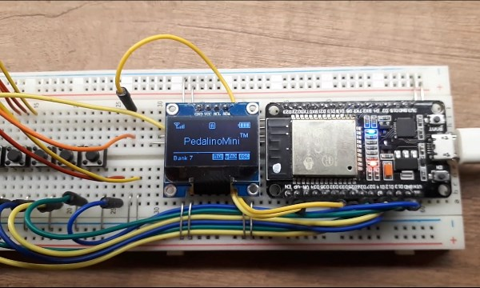
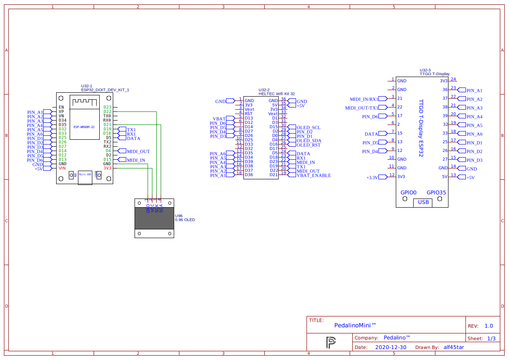
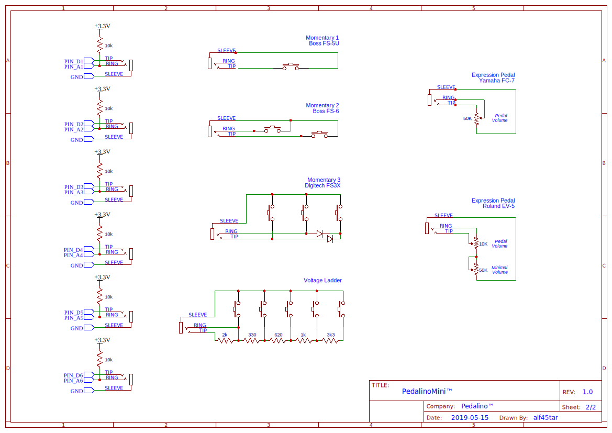
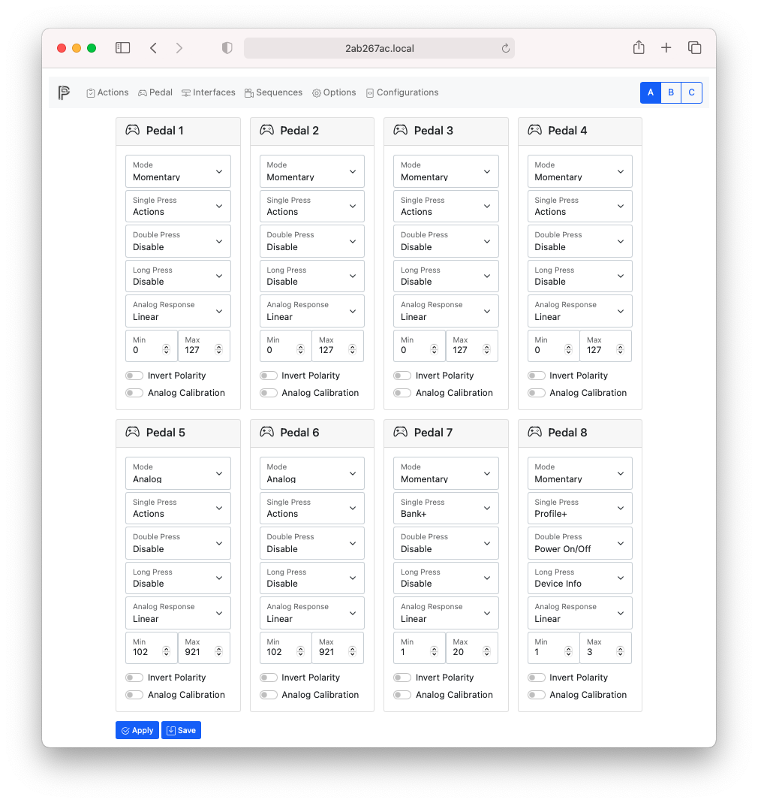
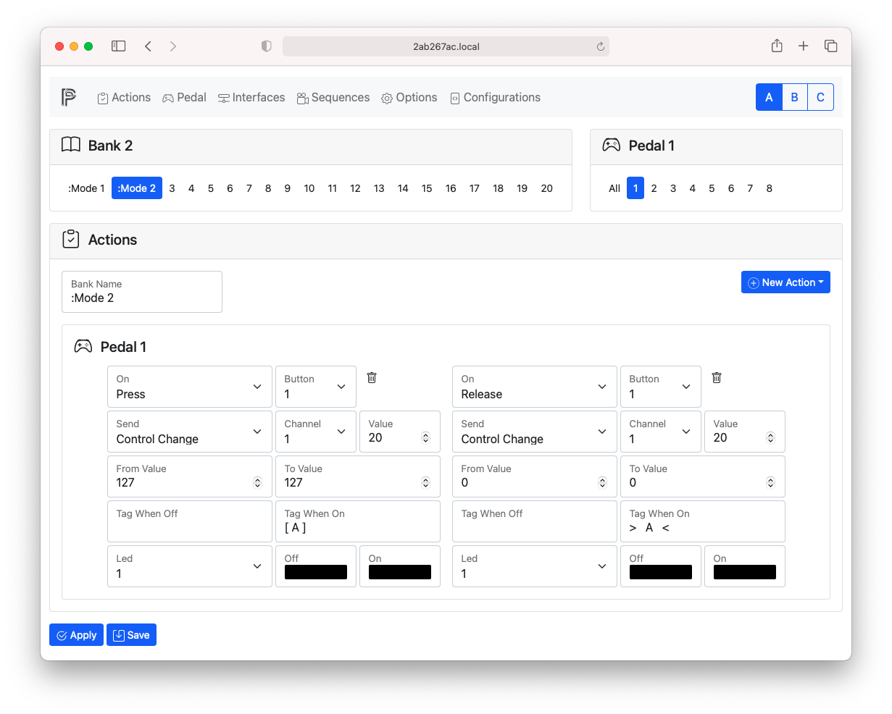
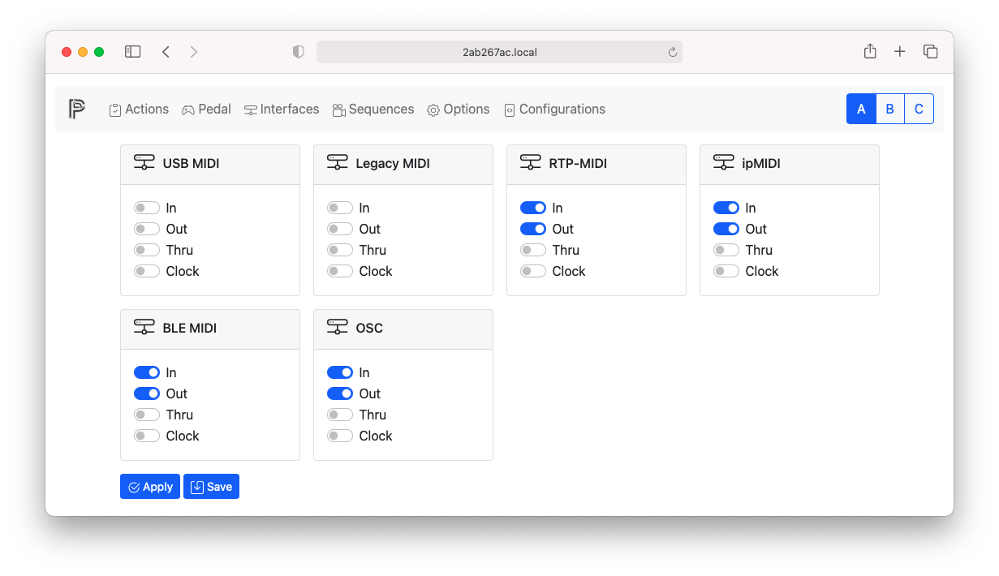
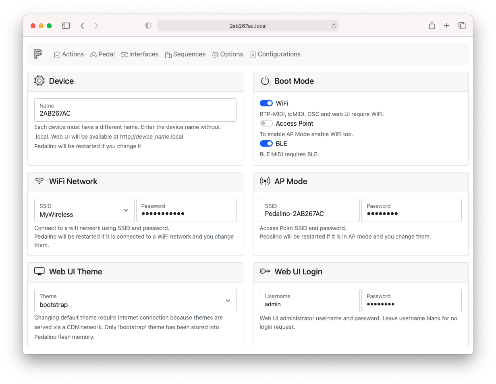
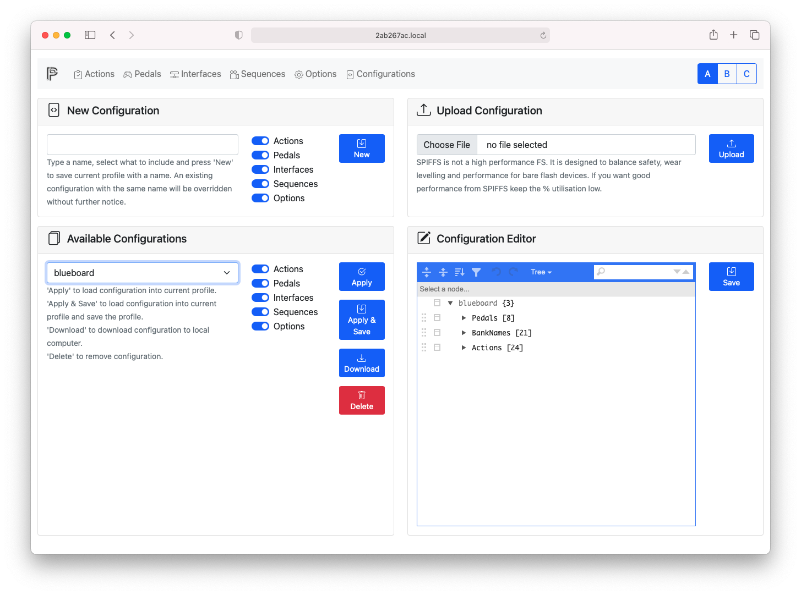
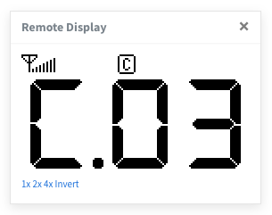
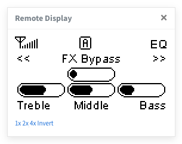

[](https://www.youtube.com/watch?v=ZqCsKDWJVQs)

> Version 2.0 is out! Hardware is the same but there are a lot of new feautures and stability improvment. Check it out.

> Before any update save configuration, reset to factory default and reload configuration. EEPROM can change without any further advice.

# PedalinoMini™


[](https://travis-ci.org/alf45tar/PedalinoMini)
[](https://www.codacy.com/manual/alf45tar/PedalinoMini?utm_source=github.com&amp;utm_medium=referral&amp;utm_content=alf45tar/PedalinoMini&amp;utm_campaign=Badge_Grade)

Wireless MIDI foot controller for guitarists and more.

- Plug-and-play with any MIDI-compatible app on iOS 8 and above as well as OS X Yosemite and above.
- High customizable using web interface
- Bluetooth, WiFI, USB and legacy MIDI interfaces
- No extra drivers to connect Windows, macOS, iOS (iPad/iPhone) and Android
- Bluetooth LE MIDI (iOS and macOS compatible)
- Network MIDI (aka AppleMIDI or RTP-MIDI)
- ipMIDI
- Open Sound Control (OSC)
- IEEE 802.11 b/g/n Wi-Fi 2.4 GHZ with WPA/WPA2 authentication
- Bluetooth Low Energy 4.0
- DIN MIDI IN and MIDI OUT connectors
- MIDI routing
- MIDI clock master and slave
- MIDI Time Code (MTC) master and slave
- OSC to MIDI and vicecersa
- Any number of pedals of any type in any order
- Auto-sensing footswitches and expression pedals

## Features

- Support for digital foot switches (momentary or latch), analog expression pedals and jog wheels (rotary encoders)
- 6 controllers ports. One controller port can support up to 6 indipendent switches for a total of 36 switches.
- 20 banks
- 3 user profiles
- 16 sequences of 10 steps each
- Each port can connect 1 expression pedal or 1 jog wheel or up to 6 foot switches via a resitors ladder (TC HELICON Switch-6).
- MIDI output via AppleMIDI (also known as RTP-MIDI) or ipMIDI via Wi-Fi
- Send almost every MIDI messages: Program Change, Control Code, Note On/Off, Channel Pressure, Pitch Bend, Bank Select, Start, Stop, Continue or a sequence of the previous messages
- MIDI channel, MIDI note, MIDI control code, MIDI program change can be configured by each pedal and by each bank
- Switch debouncing and analog noise suppression without decreasing responsivenes
- Invert polarity via software
- Individual automatic calibration of expression pedals. Manual fine tuning is not usually requested.
- Transform a linear expression pedal into log expression pedal and vice versa
- Resistors ladder calibrated is easy as pressing footswitches in sequence
- RGB NeoPixel/WS2812B status leds
- Responsive and mobile-first configuration web interface (<http://pedalino.local>)
- Smart Config technology to help users connect to a Wi-Fi network through simple app on a smartphone.
- OTA (Over the Air) firmware update or via HTTP (<http://pedalino.local/update>)

## Bill of materials

The shortest bill of materials ever: an ESP32 board and a OLED display. That's it.

- Any ESP32 board supported by [Arduino core for ESP32 WiFi chip](https://github.com/espressif/arduino-esp32)
  - Tested on [DOIT ESP32 DevKit V1](https://github.com/SmartArduino/SZDOITWiKi/wiki/ESP8266---ESP32) 4M dual-mode Wi-Fi and Bluetooth module
- OLED I2C 0.96"/1.3" display 128x64 pixels SSD1306/SH1106 based

Not enough short?

- An all-in-one [TTGO T-Eight ESP32](http://www.lilygo.cn/claprod_view.aspx?TypeId=21&Id=987&FId=t28:21:28) with a bigger OLED display (1.3"), 4MB PSRAM and lithium battery interface

USB MIDI and DIN MIDI connection requires additional hardware.

## Schematic




Do not forget the add the pull-up resistors on PIN_A1 to PIN_A6 otherwise pins will be floating. A floating pin can trigger unexpected MIDI events. As alternative you can disable the not used pedals via web interface.

## How to build and upload

[PlatformIO](https://platformio.org) is the recommended IDE for Pedalino build and upload.

1. Install [PlatformIO IDE for VSCode](https://platformio.org/install/ide?install=vscode)
2. Run the following commands from View->Command Palette (Ctrl+Shift+P)
    - Git: Clone
    - You will be asked for the URL of the remote repository (<https://github.com/alf45tar/PedalinoMini>) and the parent directory under which to put the local repository.
    - PlaftormIO: Build
    - PlatformIO: Upload
    - Run “Upload File System image” task in PlatformIO IDE or use PlatformIO Core (CLI) and 'platformio run --target uploadfs' command

That's all folks.

## USB MIDI

The cheapest and compact way to implement an USB MIDI connection is using an Arduino Pro Micro and the [BlokasLabs/USBMIDI](https://github.com/BlokasLabs/USBMIDI) library. Upload the [UsbMidiConverter](https://github.com/BlokasLabs/USBMIDI/blob/master/examples/UsbMidiConverter/UsbMidiConverter.ino) example into the Arduino Pro Micro.

Serial1 of ESP32 (re-mapped to pin 18 RX and 19 TX) is connected to Serial1 (pin 1 TX0 and pin 2 RX1) of Arduino Pro Micro. Use a 3.3V Pro Micro board. A 5V Pro Micro board works too because the ESP32 is usually 5V tolerant.

Arduino Pro Micro is powered by the USB MIDI connection.

IMPORTANT: ESP32 board and Arduino Pro Micro must share GND.

## Booting modes

PedalinoMini™ has 8 booting modes:

Mode|Name|Description
----|----|-----------
1|Normal|BLE and WiFi are enabled. PedalinoMini™ starts the WiFi procedure on boot (connect to last AP -> SmartConfig -> WPS -> Access Point).<br>After boot PedalinoMini™ will wait for BLE-MIDI connection.<br>Web UI config is disabled.
2|Bluetooth Only|WiFi is disabled.<br> PedalinoMini™ will wait for BLE-MIDI connection.
3|WiFi Only|PedalinoMini™ starts the WiFi procedure on boot (connect to last AP -> SmartConfig -> WPS -> Access Point).<br>BLE is disabled.
4|Access Point with Bluetooth|PedalinoMini™ skip the WiFi procedure on boot and create a WiFi Access Point.<br>PedalinoMini™ will wait for BLE-MIDI connection.<br>Web UI config is disabled.
5|Access Point without Bluetooth|PedalinoMini™ skips the WiFi procedure on boot and create a WiFi Access Point.<br>BLE is disabled.
6|Reset WiFi credentials|Forget the last connected access point.<br>On next boot PedalinoMini™ can be connected to a new AP.
7|Ladder Config|Learn mode for your ladder pedal. Any resistors ladder (up to 6 buttons) can be calibrated just pressing footswitches in any sequence. Footswitches are numbered depending of the corresponding analog value: lower value lower number. TC HELICON Switch-6 footswitch 1 correspond to button 6, footswitch 2 to button 5, and so on until footswitch 6 to button 1.<br>Configure at least one pedal as Ladder before to proceed with configuration.
8|Reset to factory default|

The last booting mode (1-5) is selected if you don't press any button on boot.
The default boot mode is (3) WiFi Only or (2) Bluetooth if WiFi support it is not included.

To select a different mode:

- Press and release EN button (POWER button on TTGO T-Eight) and immediately after press and hold BOOT button (CENTER button on TTGO T-Eight)
- Follow the istructions on display. Keep it pressed until the progress bar reach the end to reset to factory default. If you release the button before the progress bar reach the end PedalinoMini™ will start in one of the supported boot mode.

Mode|Name|USB-MIDI|Legacy MIDI|RTP-MIDI|ipMIDI|BLE MIDI|OSC|Web UI|OTA Firmware Update|HTTP Firmware Update
:--:|----|:------:|:---------:|:------:|:----:|:------:|:-:|:----:|:-----------------:|:------------------:
1|Normal|x|x|x|x|x|x|-|-|-
2|Bluetooth Only|x|x|-|-|x|-|-|x|-
3|WiFi Only|x|x|x|x|-|x|x|x|x
4|Access Point with Bluetooth|x|x|x|x|x|x|-|-|-
5|Access Point without Bluetooth|x|x|x|x|-|x|x|x|x

- (x) Supported
  (-) Not supported
- USB-MIDI and DIN-MIDI are always available if hardware implemented.
- Web UI config is disabled in Normal (1) and Access Point with Bluetooth (4) due to memory limit.
- OTA/HTTP Firmware Update is available only when firmware is less than 2 MB.

## How to connect PedalinoMini™ to a WiFi network

PedalinoMini™ supports IEEE 802.11 b/g/n WiFi with WPA/WPA2 authentication (only 2.4 GHz).

PedalinoMini™ implements Wi-Fi Protected Setup (WPS) and Smart Config technology ([Espressif’s ESP-TOUCH protocol](https://www.espressif.com/en/products/software/esp-touch/overview)). WPS needs access to the WPS button on the WiFi router. Smart Config requires a smartphone with one the following apps:

- [ESP8266 SmartConfig](https://play.google.com/store/apps/details?id=com.cmmakerclub.iot.esptouch) for Android
- [Espressif Esptouch](https://itunes.apple.com/us/app/espressif-esptouch/id1071176700?mt=8) for iOS

If the WiFi network is not available PedalinoMini™ will create an hotspot for you. Once connected to the PedalinoMini™ hotspot, you can use the web interface to set the SSID and password of an access point that you would like to connect to.

- On power on Pedalino will try to connect to the last know access point
- If it cannot connect to the last used access point within 15 seconds it enters into Smart Config mode
- Start one of the suggested apps to configure SSID and password
- If it doesn't receive any SSID and password during the next 15 seconds it enters into WPS mode
- Press WPS button on your WiFi router
- If it doesn't receive any SSID and password during the next 15 seconds it switch to AP mode
- In AP mode PedalinoMini™ create a WiFi network called 'Pedalino-XXXXXXXX' waiting connection from clients. The required password is XXXXXXXX (uppercase). XXXXXXXX is a variable string.
- Reboot Pedalino to restart the procedure.

```C++
void wifi_connect()
{
  auto_reconnect();           // WIFI_CONNECT_TIMEOUT seconds to reconnect to last used access point
  if (!WiFi.isConnected())
    smart_config();           // SMART_CONFIG_TIMEOUT seconds to receive SmartConfig parameters and connect
  if (!WiFi.isConnected())
    wps_config();             // WPS_TIMEOUT seconds to receive WPS parameters and connect
  if (!WiFi.isConnected())
    ap_mode_start();          // switch to AP mode until next reboot
}
```

## How to connect to the web user intertace

The responsive and mobile-first configuration web user interface is available on `http://device-name.local` address (the address is case insensitive). The device identification name is unique per device. Every device/board has a different device name. For example I am using `http://8e2de6b4.local` to connect to my PedalinoMini™.

In order to know your device name and/or the IP address press for at least half a second the BOOT button and check the display.

As alternative method you can use the IP address. If you are using the AP mode the IP address is always `192.168.4.1` and the connection address is `http://192.168.4.1` for everyone.

The default username and password to connect to web user interface are `admin` as username and your `device-name` in __uppercase__ as password. For example I am using `admin` as username and `8E2DE6B4` as password.

Device name, username and password can be changed via web user interface in the Options page.

## Pedals

Once PedalinoMini™ is connected to a WiFI network and you are connected to the web user interface it is time to configure which pedal/controller is connected to each of the 6 available ports.



____________|Description
:-----------|:----------
Mode|Select one of the following: NONE, MOMENTARY, LATCH, ANALOG, JOG WHEEL, MOMENTARY 2, MOMENTARY 3, LATCH 2, LADDER.
Function|Define a global function for the pedal. Global pedal function override any action and it is used in any bank of the profile. An example of global pedal function can be BANK+ (move to next bank) or BANK- (move to previous bank). Other function available here are: MTC Start (MIDI Time Code or MIDI Clock Start), MTC Stop (MIDI Time Code or MIDI Clock Stop), MTC Continue (MIDI Time Code or MIDI Clock Continue), TAP (tap tempo), BPM+ (increase tempo) and BPM- (decrease tempo). Leave blank to use Actions.
Analog|Mapping between analog pedal movement and response. Accepted values: LINEAR (as is response), LOG (great acceleration but than flat), ANTILOG (start slow with a rapid increase).
Min|It depends of pedal mode and/or pedal function (see below).
Max|It depends of pedal mode and/or pedal function (see below).
Invert Polarity|Normally open (NO) and normally closed (NC) momentary switches are supported and configurable by software if the foot switch do not have a polarity switch. On analog pedal it invert the range.
Single Press|Enable single press (including PRESS, RELEASE and CLICK events). If single press is disabled PRESS, RELEASE and CLICK events are disabled.
Double Press|Enable double press. If double press is enabled CLICK event is postponed until double press timeout (by default 400ms). If double press is disabled DOUBLE CLICK events are disabled.
Long Press|Enable long press. If long press is disabled LONG PRESS events are disabled.
Analog Calibration|Enable analog pedal continuous calibration. Min and Max values are managed by PedalinoMini™. After each power on cycle move the expression pedals to its full range and PedalinoMini™ will calibrate it. During the first full movement of the pedal MIDI events could be not precise because PedalinoMini™ is still learning the full range of the pedal.


Mode|Function|Min|Max
:--:|:------:|:--|:--
ANALOG|any|Minumum digital value (after analog-to-digital conversion) that can reach the connected expression pedal. Acceptable values are from 0 to 1023|Maximum digital value (after analog-to-digital conversion) that can reach the connected expression pedal. Acceptable values are from 0 to 1023.
any|BANK+|Bank # lower limit (from 1 to 20).|Bank # upper limit (from 1 to 20).
any|BANK-|Bank # lower limit (from 1 to 20).|Bank # upper limit (from 1 to 20).
any|TAP|BPM lower limit (from 40 to 300).|BPM upper limit (from 40 to 300).
any|BPM+|BPM lower limit (from 40 to 300).|BPM upper limit (from 40 to 300).
any|BPM-|BPM lower limit (from 40 to 300).|BPM upper limit (from 40 to 300).

## Actions

Once Pedals setup is complete proceed with Actions setup to define which event (press, release, double press, long press, rotate or jog) trigger an action.

1. Select a bank on top left
2. Select a pedal on top right or "All"
2. (Optional) Enter the Bank Name
3. Click on New Action and select a pedal on the dropdown menu. The pedal number of an action cannot be changed anymore without delete and recreate the action.



________|Description
:-------|:----------
Button|Every pedal support at least one "button" except for MOMENTARY 2/LATCH 2 (2 buttons), MOMENTARY 3 (3 buttons) and LADDER (6 buttons). Each button is indipendent and every action can be linked to any button.
Tag|Action name to display when action is triggered.
On|Momentary switches, latches and ladders have 5 different events that can trigger an action: PRESS, RELEASE, CLICK, DOUBLE CLICK and LONG PRESS. All of them need to be enabled on Pedals level otherwise the action is not triggered.<br>Analog expression pedals have only MOVE event.<br>Jog wheels have only JOG event.
Send|The action to be triggered on event. It can be a MIDI message (PROGRAM CHANGE, CONTROL CHANGE, NOTE ON, NOTE OFF, PITCH BEND, CHANNEL PRESSURE, START, STOP, CONTINUE), a special action (BANK+, BANK-, MTC START, MTC STOP, MTC CONTINUE, TAP, BPM+, BPM-) or a SEQUENCE of them.

Action|MIDI Channel|MIDI Code|From|To
:-----|:----------:|:-------:|:--:|:--:
PROGRAM CHANGE|Channel|PC#|-|-
CONTROL CHANGE|Channel|CC#|From Value|To Value
NOTE ON|Channel|Note|Velocity|-
NOTE OFF|Channel|Note|Velocity (+)|-
BANK SELECT+|Channel|MSB|From LSB|To LSB
BANK SELECT-|Channel|MSB|From LSB|To LSB
PROGRAM CHANGE+|Channel|-|From PC#|To PC#
PROGRAM CHANGE-|Channel|-|From PC#|To PC#
PITCH BEND|Channel|-|-|-
CHANNEL PRESSURE|Channel|-|-|-
START|-|-|-|-
STOP|-|-|-|-
CONTINUE|-|-|-|-
BANK+|-|-|From Bank|To Bank
BANK-|-|-|From Bank|To Bank
MTC START|-|-|-|-
MTC STOP|-|-|-|-
MTC CONTINUE|-|-|-|-
TAP|-|-|-|-
BPM+|-|-|-|-
BPM-|-|-|-|-
SEQUENCE|-|Sequence #|-|-

- (-) Not used
- (+) if velocity is not zero it is equivalent to NOTE ON
- MSB is the Most Significat Byte. It is a fixed value from 0 to 127.
- LSB is the Less Significat Byte. It is the variable value from 0 to 127.

## Interfaces



The supported interfaces are:

Interface|Description
:--------|:----------
USB MIDI|Plug&play USB MIDI interface. Requires additional hardware (see schematic).
Legacy MIDI|Legacy serial MIDI interface with 5 pins DIN connectors. Requires additional hardware (see schematic).
RTP-MIDI|RTP-MIDI also know as AppleMIDI or Network MIDI. It is based on UDP protocol and it requires WiFi.
ipMIDI|ipMIDI is a multicast UDP protocol and it requires WiFi. ipMIDI works only if both end points are connected to the same 2.4 GHz WiFi network. Same router is not enough when one end point is connected to a 5 GHz WiFi netowrk or to a different 2.4 GHz WiFI network hosted by the same router.
BLE MIDI|Requires Bluetooth Low Energy (BLE).
OSC|OSC messages are based on UDP protocol and it requires WiFi.

For each interface there are 4 filtering options:

______|Description
:-----|:----------
IN|Enable/disable receiving MIDI messages from the interface
OUT|Enable/disable sending MIDI messages to the interface
THRU|Enable/disable so called MIDI Thru (every message received from the IN port is automatically sent to the OUT port of the same interface)
CLOCK|Enable/disable receiving and sending CLOCK MIDI message

Routing between different interfaces is enabled between every IN enabled interfaces to any OUT enabled interfaces. Do not confuse routing (different interfaces) with MIDI Thru (between IN and OUT of same interface).

## Options

PedalinoMini™ has a lot of options well documented in the Options page.




## Configurations

The complete profile setup can be saved as configuration to be used later or just for backup reason in case of hardware failure. Configuration files can be downloaded and shared with others PedalinoMini™ users.



Some example configurations are provides. More to come.

### iRig BlueBoard

PedalinoMini™ can emulate an [IK Multimedia iRig Blueboard](https://www.ikmultimedia.com/products/irigblueboard/) using 'blueboard' configuration. Midi Mode 1 is on bank 1 and Midi Mode 2 is on bank 2. PedalinoMini™ emulation works on any MIDI interface and not only "MIDI over Bluetooth" as the original iRig Blueboard.

### Fender Mustang Amplifier

PedalinoMini™ can control a Fender Mustang I/II/III/IV Amplifier via MIDI. Additional [software](https://github.com/alf45tar/mustang-midi-bridge-win) is required to translate MIDI messages to the proprietary USB protocol used by Fender Mustang amplifiers. The bonus configuration is called 'mustang2' and works with 3 momentary switches and 3 jog wheels.

## Display mode

Where|What|Display|Description
:---:|:--:|-------|:----------
Bank Name|Empty||If the current bank name is empty the current profile and the current bank is shown using a vintage 7 segment LED style. First digit is the profile, the others two are for bank.
Bank Name|Any||If current bank name is not empty the bank name is displayed within the 6 pedal names. PedalinoMini™ assumes the first action tag for the pedal as its pedal name. The bank name screen will switch every 4 seconds to display pedals current value if no event occurs.
Bank Name|:||If the bank name start with colon (:) the bank name is always shown (if no event occurs).
Bank Name|.||If bank name start with point (.) the current values are shown and events update values in real time without any display switch.
Action Tags|:||If action tag start with colon (:) the display is not switched when an event occurs.
Action Tags|.||If action tag end with dot (.) the corresponding led and color is set on boot.
Action Tag|###||A triple hashtag sign (###) in action tag is replaced with the current value of the parameter.

## How to switch profiles

During normal operation

- Single press of BOOT button to move to the next profile
- Double press of BOOT button to move to the previous profile
- Long press of BOOT buttom to switch between live performance display and scrolling pages where configuration parameters (the device name, the IP address etc.) are displayed.

On TTGO T-Eight replace BOOT button with CENTER button.

## Factory default configuration

The factory default configuration is quite simple: 6 momentary pedals, one actions on press, all MIDI interfaces interface enabled.
More configuration are available here.
