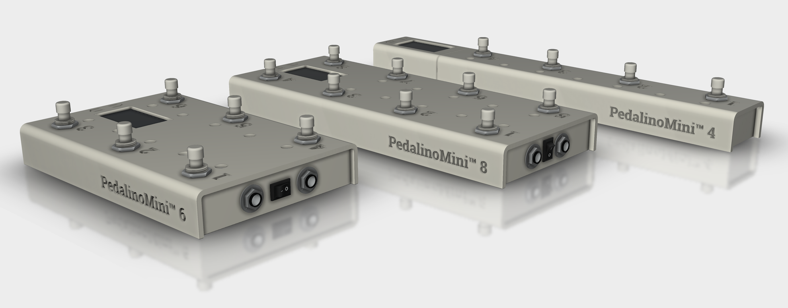

# PedalinoMini™

## Wireless controller for musicians, streamers, and presenters

**PedalinoMini™** is a versatile, wireless, multi-purpose MIDI and HID controller that empowers performers, creators, and speakers to stay fully focused on their craft — hands-free.

Keyboard emulation makes PedalinoMini™ **universally compatible** and immediately useful, even beyond music — perfect for streamers, presenters, and anyone needing hands-free or foot-operated control.

**PedalinoMini™** gives you the freedom to perform, create, and present without limits.

## **Use Cases**

### 🎸 **Musicians**

- Change digital sheet music or guitar rig presets seamlessly.
- Switch effects or amp channels without interrupting performance.
- Trigger loops, backing tracks, or DAW controls (Ableton Live, Logic Pro, etc.).
- Manage metronome tempo and tap tempo hands-free.

### 🎥 **Streamers**

- Remotely trigger OBS scenes, sound effects, overlays, or transitions.
- Mute/unmute mic or camera without leaving your chair.
- Control recording or live streaming start/stop.
- Reduce reliance on keyboard shortcuts and streamline live workflows.

### 🎤 **Presenters**

- Advance slides or control teleprompters wirelessly.
- Trigger embedded videos, animations, or navigate PDFs/websites.
- Walk freely during keynotes or webinars while maintaining control.
- Manage multiple presentation cues with multiple footswitches.

## 🚀 Meet PedalinoMini™

**PedalinoMini™** is a powerful wireless foot controller for musicians, streamers, presenters — and anyone who needs hands-free control. Whether you're switching MIDI presets, triggering OBS scenes, or flipping presentation slides, **PedalinoMini™** adapts to your workflow.

✅ Works out-of-the-box with **macOS, Windows, iOS, Android**, and all major MIDI/HID apps and platforms.

## ⚙️ Key Features

### 🧱 Hardware Versatility

- Supports up to **48 switches** (ESP32-S3) or **36 switches** (ESP32)
- Connect up to **8 controller ports**, each with up to 6 switches
- Compatible with **analog expression pedals**, jog wheels, and triggers (coming soon)
- **RGB NeoPixel LEDs** for responsive visual feedback
- **USB powered** – works via computer, adapter, or portable battery

### 🎛 Flexible Control: MIDI + HID

- Send any MIDI message: **Program Change, Control Change, Note On/Off, Pitch Bend**, and more
- Full **keyboard emulation** (USB and BLE) for shortcuts, hotkeys, and media keys
- Connectivity via **Wi-Fi, Bluetooth LE, USB**, and **DIN MIDI**
- Plug-and-play with **DAWs** (Ableton Live, Logic Pro, Reaper, etc.), **streaming tools** (OBS), and **presentation software**
- Supports **Bluetooth LE MIDI**, **AppleMIDI (RTP-MIDI)**, **ipMIDI**, **OSC**, and legacy DIN MIDI.

### 🛠️ Advanced Software Features & Customization

- Web-based setup at [`http://pedalino.local`](http://pedalino.local) — mobile-friendly and intuitive
- **20 banks**, **1 global bank**, **3 user profiles**, and **32 programmable sequences**
- Momentary or latch switch modes configurable per pedal
- **Switch debouncing** and **noise suppression** ensure reliable triggering
- Shape your expression pedal response: linear ↔ logarithmic
- **Polarity inversion** and **automatic pedal calibration**
- Resistor ladder calibration
- Latch emulation for momentary switches

## PedalinoMini™ 4

An easy way to create one is by building the [PedalinoMini™ 4](https://github.com/alf45tar/PedalinoMini-4). I aimed to keep it as simple as possible.

[PedalinoMini™ 4](https://github.com/alf45tar/PedalinoMini-4) operates seamlessly with its 4 footswitches, featuring a big 1.9" color display equipped with WiFi, Bluetooth, and USB capabilities. It is powered through a USB-C port from the computer or using either a power adapter or, for enhanced convenience, a compact power bank, ensuring up to 6 hours of uninterrupted functionality.

## PedalinoMini™ 6/8

Do you need more footswitches? [PedalinoMini™ 6](https://github.com/alf45tar/PedalinoMini-6) or [PedalinoMini™ 8](https://github.com/alf45tar/PedalinoMini-8) is for you.

## 📚 Documentation & Resources

- Hardware
  - [Bill of Materials](<doc/BOM and Schematics.md#bill-of-materials>)
  - [Schematics](<doc/BOM and Schematics#schematic.md>)
  - [USB MIDI for ESP32 boards](<doc/USB MIDI for ESP32.md>)

- Software
  - [First Steps](<doc/First Steps.md>)
    - [Firmware upload, WiFi setup, first access](<doc/First Steps.md#how-to-upload-firmware-wifi-provisioning-and-first-access-to-web-user-interface>)
    - [WiFi Provisioning](<doc/First Steps.md#how-to-connect-pedalinomini-to-a-wifi-network>)
    - [Web user interface access](<doc/First Steps.md#how-to-connect-to-the-web-user-intertace>)
  - [Pedals & Controls](<doc/Pedals and Controls.md>)
  - [Actions](<doc/Actions.md>)
  - [Sequences](<doc/Sequences.md>)
  - [Interfaces](<doc/Interfaces.md>)
  - [Options](<doc/Options.md>)
  - [Configurations](<doc/Configurations.md>)
  - [Keyboard Emulation](<doc/Keyboard Emulation.md>)
  - [Mouse Emulation](<doc/Mouse Emulation.md>)
  - [Profiles](<doc/Profiles.md>)

- Licensing
  - [Licensing & Activation](<doc/Licensing.md#-licensing--activation>)
  - [How activation works](<doc/Licensing.md#-how-activation-works>)
  - [About Demo Mode](<doc/Licensing.md#-about-demo-mode>)
  - [Open Source Notice](<doc/Licensing.md#-open-source-notice>)
  - [Why Closed Source?](<doc/Licensing.md#-why-move-to-closed-source>)
  - [FAQ](<doc/Licensing.md#-frequently-asked-questions-faq>)

- Community Contributions
  - [Sponsors](<doc/Sponsors.md>)
  - [End User Built](<doc/End User Built.md>)

- [Version History](<doc/Versions History.md>)