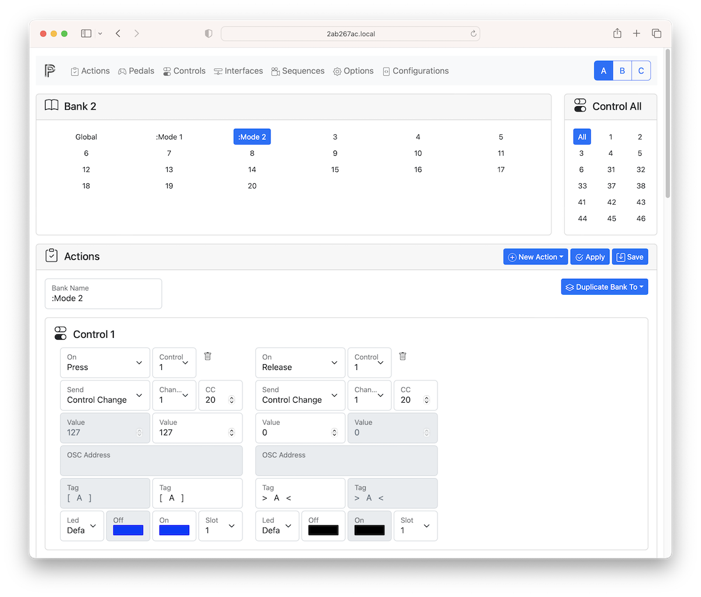
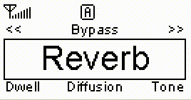
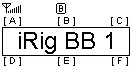
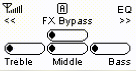
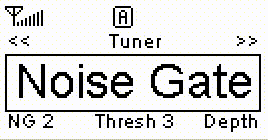

# Actions

Once Controls setup is complete proceed with Actions setup to define which event (press, release, double press, long press, repeat pressed, long release, move or jog) trigger an action.

1. Select a bank on top left. Bank 0 is also called global bank. Actions added to bank 0 are active in all the others banks.
2. Select a control on top right or "All"
3. (Optional) Enter the Bank Name
4. Click on New Action and select a control on the dropdown menu.

| ________ | Description                                                                                                                                                                                                                                                                                                                                                                                                                                                                                                                                                                     |
| :------- | :------------------------------------------------------------------------------------------------------------------------------------------------------------------------------------------------------------------------------------------------------------------------------------------------------------------------------------------------------------------------------------------------------------------------------------------------------------------------------------------------------------------------------------------------------------------------------ |
| On       | The event that trigger the action. Momentary switches, latches and ladders have 7 different events: PRESS, RELEASE, PRESS&RELEASE, CLICK, DOUBLE CLICK, LONG PRESS, REPEAT PRESSED and LONG RELEASE. All of them need to be enabled on Pedals level otherwise the action is not triggered. Analog expression pedals have only MOVE event. Jog wheels have only JOG event.                                                                                                                                                                                              |
| Control  | The control that trigger the event as defined in Controls page.                                                                                                                                                                                                                                                                                                                                                                                                                                                                                                                 |
| Send     | The action to be triggered on event. It can be a MIDI message (PROGRAM CHANGE, CONTROL CHANGE, NOTE ON, NOTE OFF, PITCH BEND, CHANNEL PRESSURE, START, STOP, CONTINUE), a special action (BANK SELECT+, BANK SELECT-, PROGRAM CHANGE+, PROGRAM CHANGE-, BANK+, BANK-, MTC START, MTC STOP, MTC CONTINUE, TAP, BPM+, BPM-) or a SEQUENCE of them. For an analog pedal leave it blank to activate the universal mode. In universal mode an analog pedal can be used to repeat the last MIDI message. A typical usage is to modify the value of the last CONTROL CHANGE. 
From Value/To Value|Define the range from a off value to a on value (see below).
Tags When Off|Action name to display when off action is triggered.
Tags When On|Action name to display when on action is triggered.
Led|Select the led number and the off and on color. Use Default for use the default led defined in Pedals.

| Action              | MIDI Channel | MIDI Code  |     From      |     To      |
| :------------------ | :----------: | :--------: | :-----------: | :---------: |
| Program Change      |   Channel    |    PC#     |       -       |      -      |
| Control Change      |   Channel    |    CC#     |  From Value   |  To Value   |
| Control Change Snap |   Channel    |    CC#     |  From Value   |  To Value   |
| Note On             |   Channel    |    Note    |   Velocity    |      -      |
| Note Off            |   Channel    |    Note    | Velocity (+)  |      -      |
| Bank Select+        |   Channel    |    MSB     |   From LSB    |   To LSB    |
| Bank Select-        |   Channel    |    MSB     |   From LSB    |   To LSB    |
| Program Change+     |   Channel    |     -      |   From PC#    |   To PC#    |
| Program Change-     |   Channel    |     -      |   From PC#    |   To PC#    |
| Pitch Bend          |   Channel    |     -      |       -       |      -      |
| Channel Pressure    |   Channel    |     -      |       -       |      -      |
| MIDI Clock Master   |      -       |     -      |       -       |      -      |
| MIDI Clock Slave    |      -       |     -      |       -       |      -      |
| MIDI Clock Off      |      -       |     -      |       -       |      -      |
| Start               |      -       |     -      |       -       |      -      |
| Stop                |      -       |     -      |       -       |      -      |
| Ccontinue           |      -       |     -      |       -       |      -      |
| Sequence            |      -       | Sequence # |       -       |      -      |
| Step By Step+       |      -       |     -      |       -       |      -      |
| Step By Step-       |      -       |     -      |       -       |      -      |
| Bank+               |      -       |     -      |   From Bank   |   To Bank   |
| Bank-               |      -       |     -      |   From Bank   |   To Bank   |
| MTC Master          |      -       |     -      |       -       |      -      |
| MTC Slave           |      -       |     -      |       -       |      -      |
| MTC Off             |      -       |     -      |       -       |      -      |
| MTC Start           |      -       |     -      |       -       |      -      |
| MTC Stop            |      -       |     -      |       -       |      -      |
| MTC Continue        |      -       |     -      |       -       |      -      |
| Tap                 |      -       |     -      |       -       |      -      |
| BPM+                |      -       |     -      |       -       |      -      |
| BPM-                |      -       |     -      |       -       |      -      |
| OSC Message         |      -       |     -      |       -       |      -      |
| Key                 |      -       |     -      |       -       |      -      |
| Profile+            |      -       |     -      | From Profile# | To Profile# |
| Profile-            |      -       |     -      | From Profile# | To Profile# |
| Set Led Color       |      -       |     -      |       -       |      -      |
| Repeat              |      -       |     -      |       -       |      -      |
| Repeat Overwrite    |   Channel    |     -      |  From Value   |  To Value   |
| Device Info         |      -       |     -      |       -       |      -      |
| Power On/Off        |      -       |     -      |       -       |      -      |

- (-) Not used
- (+) if velocity is not zero it is equivalent to NOTE ON
- MSB is the Most Significat Byte. It is a fixed value from 0 to 127.
- LSB is the Less Significat Byte. It is the variable value from 0 to 127.

## Display mode

|    Where    | What  | Display                         | Description                                                                                                                                                                                                                                                             |
| :---------: | :---: | ------------------------------- | :---------------------------------------------------------------------------------------------------------------------------------------------------------------------------------------------------------------------------------------------------------------------- |
|  Bank Name  | Empty |  | If the current bank name is empty the current profile and the current bank is shown using a vintage 7 segment LED style. First digit is the profile, the others two are for bank.                                                                                       |
|  Bank Name  |  Any  |  | If current bank name is not empty the bank name is displayed within the 6 pedal names. PedalinoMini™ assumes the first action tag for the pedal as its pedal name. The bank name screen will switch every 4 seconds to display pedals current value if no event occurs. |
|  Bank Name  |   :   |  | If the bank name start with colon (:) the bank name is always shown (if no event occurs).                                                                                                                                                                               |
|  Bank Name  |   .   |  | If bank name start with point (.) the current values are shown and events update values in real time without any display switch.                                                                                                                                        |
|  Bank Name  |  ##   |                                 | A double hashtag sign (##) in bank name is replaced with the bank number.                                                                                                                                                                                               |
| Action Tags |   :   |  | If action tag start with colon (:) the display is not switched when an event occurs.                                                                                                                                                                                    |
| Action Tags |   .   |                            | If action tag end with dot (.) the corresponding led and color is set on boot.                                                                                                                                                                                          |
| Action Tag  |  ###  |  | A triple hashtag sign (###) in action tag is replaced with the current value of the parameter.                                                                                                                                                                          |
