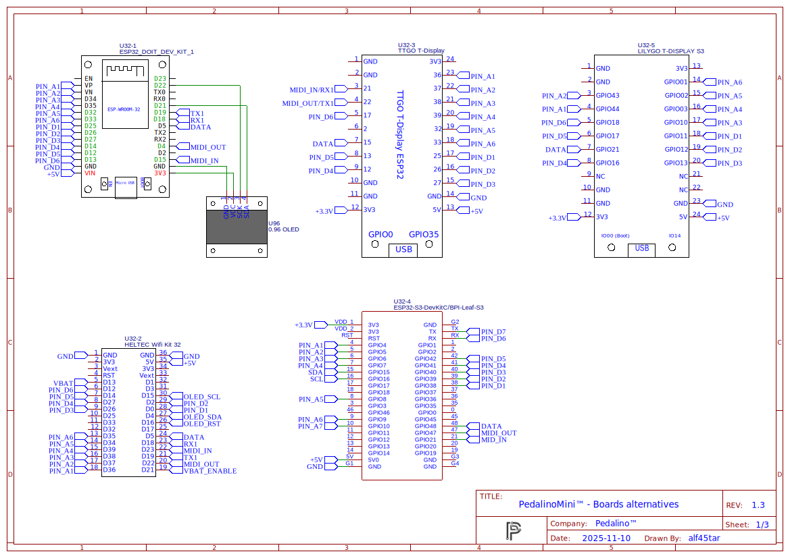

# Bill of Materials

The **ESP32-S3** is the preferred standard board for all new deployments of PedalinoMini™.
Please note that some of the newest features are only supported on the ESP32-S3 and **not** on the original ESP32.

## 💡 Core Components

- **Preferred board:**
  - **ESP32-S3** module (e.g., [**LILYGO® T-Display-S3**](https://www.lilygo.cc/products/t-display-s3?variant=42351558590645), [**BPI-Leaf-S3**](https://wiki.banana-pi.org/BPI-Leaf-S3) )
    - Supports USB HID keyboard, Bluetooth LE keyboard, and other advanced features exclusive to ESP32-S3.

- **Legacy board (supported but limited features):**
  - ESP32 (e.g., [[**LILYGO® TTGO T-Display**](http://www.lilygo.cn/prod_view.aspx?TypeId=50033&Id=1126&FId=t3:50033:3), [**DOIT ESP32 DevKit V1**](https://github.com/SmartArduino/SZDOITWiKi/wiki/ESP8266---ESP32), )
    - Does **not** support USB HID keyboard or Bluetooth LE keyboard modes.

- **Display Options:**
  - Separate OLED I2C displays (0.96" or 1.3", SSD1306/SH1106 based)
  - All-in-one boards with integrated displays

### ⚡ All-in-one Boards

- [**LILYGO® T-Display-S3**](https://www.lilygo.cc/products/t-display-s3?variant=42351558590645)
  - 1.9" IPS display, onboard lithium battery interface, ESP32-S3 core
- [**LILYGO® TTGO T-Display**](https://lilygo.cc/products/lilygo%C2%AE-ttgo-t-display-1-14-inch-lcd-esp32-control-board?variant=42159376433333)
  - 1.14" IPS display, lithium battery interface
- [**Heltec WiFi Kit 33 (V2)**](https://heltec.org/project/wifi-kit32-v3/)
  - 0.96" OLED display, lithium battery interface
- [**TTGO T-Eight ESP32**](https://github.com/LilyGO/TTGO-T-Eight-ESP32)
  - 1.3" OLED display, 4MB PSRAM

## ⚡ Legacy Boards (ESP32)

- [**DOIT ESP32 DevKit V1**](https://github.com/SmartArduino/SZDOITWiKi/wiki/ESP8266---ESP32)
  - 4MB dual-mode Wi-Fi and Bluetooth

## Summary

| Board                      | Display                        | Size           | Battery Support | Extra Features                  |
|----------------------------|--------------------------------|----------------|-----------------|---------------------------------|
| **DOIT ESP32 DevKit V1**   | Separate OLED (SSD1306/SH1106) | 0.96" or 1.3"  | No              | Basic, flexible choice          |
| **Heltec WiFi Kit 32**     | OLED                           | 0.96"          | Yes             | Integrated OLED, compact        |
| **TTGO T-Eight ESP32**     | OLED                           | 1.3"           | Yes             | 4MB PSRAM, larger display       |
| **LILYGO® TTGO T-Display** | IPS LCD                        | 1.14"          | Yes             | Compact, all-in-one             |
| **BPI-Leaf-S3**            | External or optional OLED      | —              | Yes             | ESP32-S3, more power            |
| **LILYGO® T-Display-S3**   | IPS LCD                        | 1.9"           | Yes             | ESP32-S3, larger bright display |

- USB MIDI (ESP32 only) and DIN MIDI connections require extra hardware components.

## Schematic

### Warnings

- Do not forget the add the pullup resistors on PIN_A1 to PIN_A6 otherwise pins will be floating. A floating pin can trigger unexpected MIDI events. As alternative you can disable the not used pedals via web interface.
- GPIO12 must be LOW during boot. MTDI (GPIO12) is used as a bootstrapping pin to select output voltage of an internal regulator which powers the flash chip (VDD_SDIO). This pin has an internal pulldown so if left unconnected it will read low at reset (selecting default 3.3V operation). Connect to the corresponding controller port only pedals that can guarantee a LOW value on boot. For more details check the [official documentation](https://docs.espressif.com/projects/esp-idf/en/latest/api-reference/peripherals/sd_pullup_requirements.html#mtdi-strapping-pin).

To create your own ladder you can start simulating the below ones:

Simulate voltage ladder 2k 3k 5.1k 10k 30K

- [Thinkercad](https://www.tinkercad.com/things/7m1vdQfmXFo)
- [Circuit Simulation Applet](https://tinyurl.com/2mrlxab7)

Simulate voltage ladder 10k (TC-Helicon Switch 6)

- [Thinkercad](https://www.tinkercad.com/things/jnovvmmsONp)
- [Circuit Simulation Applet](https://tinyurl.com/2ptxv97t)

Simulate "D1 Robot LCD Keypad Shield" voltage ladder

- [Thinkercad](https://www.tinkercad.com/things/jQAR4Hrh3GH)
- [Circuit Simulation Applet](https://tinyurl.com/2zbrnsh6)
