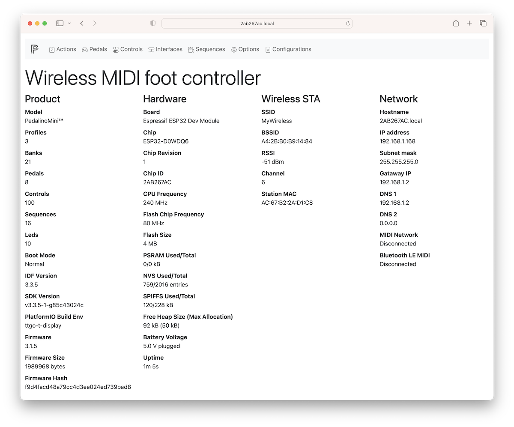

## How to upload firmware, WiFi provisioning and first access to web user interface

Visit http://alf45tar.github.io/PedalinoMini to install firmware, update firmware, connect device to a WiFi network and visit the device's hosted web interface.

The only requirement for now is to use a Google Chrome or Microsoft Edge browser (Safari and iOS devices are not supported yet). WiFi provisioing via Bluetooth is only supported in Google Chrome on Windows.

<details>
<summary>Detailed instructions</summary>

1. Connect PedalinoMini™ to a PC via USB
2. Visit http://alf45tar.github.io/PedalinoMini
3. Select your device and the latest firmware is automatically selected
4. Press "Connect to USB"
5. Select the USB/UART port where PedalinoMini™ is connected and press "Ok"
6. Select "Install PedalinoMini™" and confirm to erase all data pressing "Install"
7. Wait a couple of minutes to complete the installation and press "Next" at the end
8. Reboot PedalinoMini™ and complete the WiFi provisioning
9. Press "Connect to WiFi"
10. Enter the Network Name and the Password of your WiFi and press "Connect"
11. Press "Visit device" to access web user interface

</details>

## How to connect PedalinoMini™ to a WiFi network

PedalinoMini™ supports IEEE 802.11 b/g/n WiFi with WPA/WPA2 authentication (only 2.4 GHz).

PedalinoMini™ support 5 WiFi provisioning methods: 1 via USB, 1 via Bluetooth and 3 via WiFi.

PedalinoMini™ is using [ESP Web Tools](https://esphome.github.io/esp-web-tools/) not only to install the firmware, via USB with a click of button right from you browser, but also to connect it to WiFi with the same simplicity via USB or Bluetooth.

PedalinoMini™ also implements Wi-Fi Protected Setup (WPS) and Smart Config technology ([Espressif’s ESP-TOUCH protocol](https://www.espressif.com/en/products/software/esp-touch/overview)). WPS needs access to the WPS button on the WiFi router. Smart Config requires a smartphone with one the following apps:

- [ESP8266 SmartConfig](https://play.google.com/store/apps/details?id=com.cmmakerclub.iot.esptouch) for Android
- [Espressif Esptouch](https://itunes.apple.com/us/app/espressif-esptouch/id1071176700?mt=8) for iOS

If the WiFi network is not available PedalinoMini™ will create an hotspot for you. Once connected to the PedalinoMini™ hotspot, you can use the web interface to set the SSID and password of an access point that you would like to connect to.

- On power on PedalinoMini™ will try to connect to the last know access point
- If it cannot connect to the last used access point within 15 seconds it enters into WiFi provisioning mode via USB or Bluetooth
- Visit http://alf45tar.github.io/PedalinoMini and follow the instructions
- If provisioning is not finished within 60 seconds it enters into Smart Config mode (if compiled with -D SMARTCONFIG in platformio.ini)
- Start one of the suggested apps to configure SSID and password
- If it doesn't receive any SSID and password during the next 60 seconds it enters into WPS mode (if compiled with -D WPS in platformio.ini)
- Press or press and hold (it depends by your router) the WPS button on your WiFi router __after__ PedalinoMini™ entered in WPS mode
- If it doesn't receive any SSID and password during the next 60 seconds it switch to AP mode
- In AP mode PedalinoMini™ create a WiFi network called 'Pedalino-XXXXXXXX' waiting connection from clients. The required password is XXXXXXXX (uppercase). XXXXXXXX is a variable string.
- Reboot PedalinoMini™ to restart the procedure.

Any of the previous steps can be skipped pressing BOOT button.

```C++
void wifi_connect()
{
  auto_reconnect();           // WIFI_CONNECT_TIMEOUT seconds to reconnect to last used access point
  if (!WiFi.isConnected())
    improv_config();          // IMPROV_CONFIG_TIMEOUT seconds to receive provisioning SSID and password via USB or Bluetooth and connect to WiFi
  if (!WiFi.isConnected())
    smart_config();           // SMART_CONFIG_TIMEOUT seconds to receive SmartConfig parameters and connect
  if (!WiFi.isConnected())
    wps_config();             // WPS_TIMEOUT seconds to receive WPS parameters and connect
  if (!WiFi.isConnected())
    ap_mode_start();          // switch to AP mode until next reboot
}
```

## How to connect to the web user intertace

The responsive and mobile-first configuration web user interface is available on `http://device-name.local` address (the address is case insensitive). The device identification name is unique per device. Every device/board has a different device name. For example I am using `http://2ab267ac.local` to connect to my PedalinoMini™.



In order to know your device name and/or the IP address press for at least half a second the BOOT button and check the display.

As alternative method you can use the IP address. If you are using the AP mode the IP address is always `192.168.4.1` and the connection address is `http://192.168.4.1` for everyone.

There is no credentials to connect to web user interface. Device name and credentials to connect to web user interface can be changed in the Options page.
